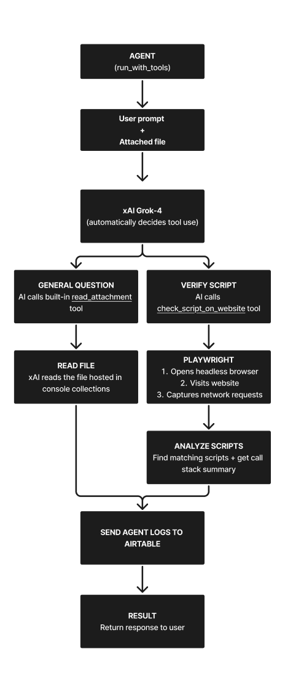

### Click the YouTube link below to watch an overview of how this agent works 🎥
https://www.youtube.com/watch?v=ZK-R9LbOHhI
---
Tech support AI agent that provides details on your app's integrations and automatically verifies their implementation on a website.
> **Designed to automate the repetitive process of troubleshooting integrations, saving time on manual verification.**

**Tech Stack:** Python, xAI SDK, Playwright API, Airtable API

### Features
- 🔍 Answers questions about integrations from documentation
- ✅ Verifies script implementations on live websites
- 📊 Logs results to Airtable for human verification & prompt tuning

## 
 Agent Architecture (How it works)  
